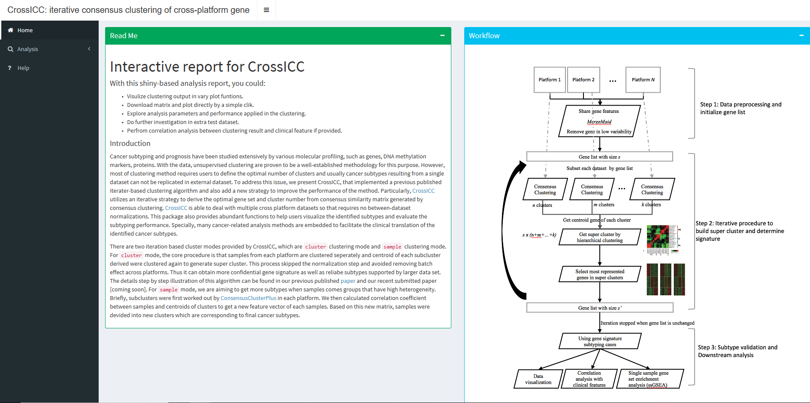

<!-- README.md is generated from README.Rmd. Please edit that file -->
CrossICC
========

Overview
--------

Cancer subtyping and prognosis have been studied extensively by various molecular profiling, such as genes, DNA methylation markers, proteins. With the data, unsupervised clustering are proven to be a well-established methodology for this purpose. However, most of clustering method requires users to define the optimal number of clusters and usually cancer subtypes resulting from a single dataset can not be replicated in external dataset. To address this issue, we present CrossICC, that implemented a previous published iterater-based clustering algorithm and also add a new strategy to improve the performance of the method. Particularly, [CrossICC](https://github.com/bioinformatist/CrossICC) utilizes an iterative strategy to derive the optimal gene set and cluster number from consensus similarity matrix generated by consensus clustering. [CrossICC](https://github.com/bioinformatist/CrossICC) is able to deal with multiple cross platform datasets so that requires no between-dataset normalizations. This package also provides abundant functions to help users visualize the identified subtypes and evaluate the subtyping performance. Specially, many cancer-related analysis methods are embedded to facilitate the clinical translation of the identified cancer subtypes.

There are two iteration based cluster modes provided by CrossICC, which are `balanced` clustering mode and `finer` clustering mode. For `balanced` mode, the core procedure is that samples from each platform are clustered seperately and centroid of each subcluster derived were clustered again to generate super cluster. This process skipped the normalization step and avoided removing batch effect across platforms. Thus it can obtain more confidential gene signature as well as reliabe subtypes supported by larger data set. The details step by step illustration of this algorithm can be found in our previous published [paper](http://clincancerres.aacrjournals.org/content/early/2014/12/09/1078-0432.ccr-14-2481) and our recent submitted paper\[coming soon\]. For `finer` mode, we are aiming to get more subtypes when samples comes groups that have high heterogeneity. Briefly, subclusters were first worked out by [ConsensusClusterPlus](https://bioconductor.org/packages/release/bioc/html/ConsensusClusterPlus.html) in each platform. We then calculated correlation coefficient between samples and centroids of clusters to get a new feature vector of each samples. Based on this new matrix, samples were devided into new clusters which are corresponding to final cancer subtypes.

Installation
------------

### Via GitHub (latest)

``` r
install.packages("devtools")
devtools::install_github("bioinformatist/CrossICC")
```

Usage
-----

CrossICC has the ability to automatically process **arbitrary numbers** of expression datasets, **no matter which platform they came from** (Even you can **use sequencing and microarray data together**). What you **only** need is a list of matrices in R, without any type of pre-processing (never need manipulation like filtering or normalization).

``` r
library(CrossICC)
CrossICC.obj <- CrossICC(demo.platforms, skip.mfs = TRUE, max.iter = 100, 
                         cross = "cluster", fdr.cutoff = 0.1, 
                         ebayes.cutoff = 0.1, filter.cutoff = 0.1)
```

CrossICC will automatically iterate your data until it reaches convergence. By default, CrossICC will generate an `.rds` formatted object in your home path (`~/`, a.k.a `$HOME` in Linux), followed by an shiny app as shown below that is opened in your default browser, which provides you a very intuitive way to view the results.



FAQ
===

-   Question 1: ***My bro pls fill here***:smile:

> A: This error is usually introduced by NA values in your expression data. users may also encounter other unexpected error due to NA values in raw dataset. Therefore, we strong recommanded that users checked the NA valus in thire data set before loading it into `CrossICC`. To check the completed cases in matrix, `completed.cases` can be a good option to do that. Here, we also present an example for users to impute there data in case they don't want to remove case in the dataset. The imputation method shown here are KNN method from impute package.

``` r
# for a individual matrix, plz do imputation using the following r code
tempdata.impute=impute.knn(as.matrix(tempdata) ,k = 10, rowmax = 0.5, colmax = 0.8)
normalize.Data=as.data.frame(tempdata.impute$data)
```
