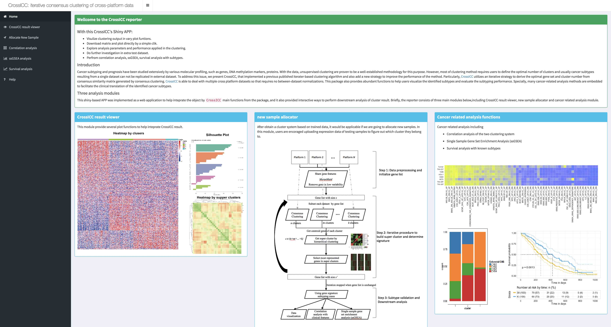

```{r echo=FALSE}
CRANpkg <- function (pkg) {
    cran <- "https://CRAN.R-project.org/package"
    fmt <- "[%s](%s=%s)"
    sprintf(fmt, pkg, cran, pkg)
}
Biocpkg <- function (pkg) {
    sprintf("[%s](http://bioconductor.org/packages/%s)", pkg, pkg)
}
```


# Citation

If you use `CrossICC` in your published research, please cite this paper:

# Introduction

Unsupervised clustering of high-throughput molecular profiling data is widely adopted for discovering cancer subtypes. However, cancer subtypes derived from a single dataset are not usually applicable across multiple datasets from different platforms. We previously published an iterative clustering algorithm to address the issue (see this paper), but its use was hampered due to lack of implementation.

In this project, we present CrossICC to implement this method. Moreover, many new features were added to improve the performance of the algorithm. Briefly, CrossICC utilizes an iterative strategy to derive the optimal gene set and cluster number from consensus similarity matrix generated by consensus clustering. CrossICC is able to deal with multiple cross platform datasets so that requires no between-dataset normalizations. This package also provides abundant functions to help users visualize the identified subtypes and evaluate the subtyping performance. Specially, many cancer-related analysis methods are embedded to facilitate the clinical translation of the identified cancer subtypes.

# Installation

1. Download & install the package.

To install via Bioconductor (coming soon):

```{r getPackage, eval=FALSE}
if (!requireNamespace("BiocManager", quietly = TRUE))
    install.packages("BiocManager")
BiocManager::install("CrossICC")
```

The development version is also available to download from Github. 
```{r getDevel, eval=FALSE}
BiocManager::install("bioinformatist/CrossICC")
```

2. Load the package into R session.

```{r Load, message=FALSE, eval = TRUE}
library(CrossICC)
```

# Getting data into R

Most of the tools for clustering require users to combine all of dataset, while CrossICC only needs a `list` object in R. 
We also provide a function `CrossICCInput` for importing multiple files as a `list`.

```r
files <- list.files(path = "",pattern = ".csv")
CrossICC.input <- CrossICCInput(files)
```

> NOTE: CrossICCInput() internally call `data.table::fread()`, so you never need specify a separator.

# Run CrossICC

CrossICC is easy enough for using by just calling the function  with default parameters. You can run function `predictor()` to calculate the correlation between the predictor centroid and the validation centroid and you can also get GSEA-like ranked matrix from CrossICC result by running function of `ssGSEA()`. We also provide a graphical interface  which can help users to check the result of CrossICC in a very intuitive way.

{width=100%}

# An example

To run CrossICC:

```{r}
library(CrossICC)
data(demo.platforms)
# Turn on use.shiny parameter if you want to call shiny once the CrossICC finished
CrossICC.obj <- CrossICC(demo.platforms, skip.mfs = TRUE, use.shiny = FALSE)
```

CrossICC will generate an `.rds` formatted object in your home path (`~/`, a.k.a `$HOME` in Linux), which records key features (genes), iteration times and other information during analysis in a compressed file format. You can call shiny app with this file later.

To compare samples according to their pathway information, we provide a way to get GSEA-like ranked eigenvalue matrix:

```{r}
CrossICC.ssGSEA <- ssGSEA(x = demo.platforms[[1]], gene.signature = CrossICC.object$gene.signature, geneset2gene = CrossICC.object$unioned.genesets, cluster = CrossICC.object$clusters$clusters[[1]])
```

And you can use CrossICC's result as model for clustering new samples, simply by calculate the correlation between the predictor centroid and the validation centroid:

```{r}
predicted <- predictor(demo.platforms[[1]], CrossICC.object)
```

`new.exprs` is your expression matrix, and CrossICC's result `CrossICC.obj` can be used as model. The process will take a few minutes.

# Need helps?

If you have issues/questions, please visit CrossICC homepage(https://github.com/bioinformatist/CrossICC) first. 
If you think you have found a bug, please provide a reproducible example to be posted on
[github issue tracker](https://github.com/bioinformatist/CrossICC/issues).

# SessionInfo()

```{r}
sessionInfo()
```
